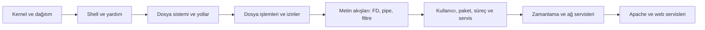

# Linux Fundamentals — Öğrenme Haritası

> [!success] Kaynaklar korundu
> Bu klasör geliştirilmiş kopyadır. Özgün notlar `Linux Fundamentals by HTB` klasöründe değişmeden durur.

## Nasıl çalışmalısın?

1. Önce aşağıdaki sırayla notun **öğrenme hedefini** ve **düzeltmelerini** oku.
2. Özgün not bölümünü kendi cümlelerinle yeniden anlat.
3. Mini labı çalıştırmadan önce çıktıyı tahmin et; sonra sonucu açıklamaya çalış.
4. Bir sonraki nota geçmeden bilişsel bağlantılardan en az birini aç.
5. 1, 3, 7 ve 14 gün sonra komutlara bakmadan kısa tekrar yap.

## Ana zihinsel model

## Önerilen sıra

1. [[1-Intro]] — Linux, kernel, işletim sistemi ve temel bileşenleri birbirinden ayırmak.
2. [[3-Intro]] — Linux dağıtımlarını ve FHS dizinlerinin amaçlarını anlamak.
3. [[4-Prompt Description]] — Shell promptunun kullanıcı, makine, konum ve yetki bilgisini okumak.
4. [[5- Getting Help in Shell]] — Komutları ezberlemek yerine yerleşik yardım sistemini etkin kullanmak.
5. [[6-System Information]] — Kimlik, donanım, ağ ve süreç bilgisini doğru araçla toplamak.
6. [[7-Navigation]] — Yolları, gizli dosyaları, inode ve dosya metadatasını okuyabilmek.
7. [[8-Working with Files and Directories]] — Dosya/dizin oluşturma, taşıma, kopyalama ve güvenli silme akışını öğrenmek.
8. [[9-Editing Files]] — Nano, Vim ve cat ailesinin rollerini doğru ayırmak.
9. [[10-Find Files and Directories]] — Komut ve dosyaları doğru arama yöntemiyle bulmak.
10. [[11-File Descriptors and Redirections]] — STDIN, STDOUT, STDERR, yönlendirme ve pipe veri akışını anlamak.
11. [[12-Filter Contents]] — Metin akışlarını küçük araçlarla seçmek, dönüştürmek ve saymak.
12. [[13-Regular Expressions]] — Regex desenlerini shell globlarından ayırıp güvenle kullanmak.
13. [[14-Permission Management]] — Linux sahiplik ve rwx izinlerini dosya/dizin bağlamında yorumlamak.
14. [[15-User Management]] — Kullanıcı, grup, UID/GID ve hesap yaşam döngüsünü yönetmek.
15. [[16-Package Management]] — Depo, paket, bağımlılık ve güncelleme zincirini güvenli yönetmek.
16. [[17-Service and Process Management]] — Süreç, job, signal ve systemd servis durumlarını ayırmak.
17. [[18-Task Scheduling]] — Tekrarlanan işleri cron ve systemd timer ile güvenilir biçimde çalıştırmak.
18. [[19-Network Services]] — SSH, NFS, web ve VPN servislerinin amaç, port ve güvenlik sınırlarını kavramak.
19. [[20-Working with Web Services]] — Apache modüllerini, sanal hostları, logları ve HTTP testini bir araya getirmek.
20. [[Extra by Bandit]] — Bandit’te karşılaşılan kodlama/dönüştürme tekniklerini güvenlik bağlamıyla öğrenmek.

## Dört temel bağlantı

- **Her şey dosya gibi temsil edilir:** aygıtlar (`/dev`), süreç bilgisi (`/proc`), yapılandırmalar (`/etc`) ve normal dosyalar aynı araçlarla gözlemlenebilir.
- **Komutlar veri akışı kurar:** STDIN → program → STDOUT/STDERR; pipe ve filtreler küçük araçları bir sisteme dönüştürür.
- **Kimlik + izin + süreç birlikte düşünülür:** hangi kullanıcı olduğun, hangi dosyaya erişebildiğin ve hangi servisi yönetebildiğin birbirine bağlıdır.
- **Ağ servisi çalışan bir süreçtir:** paket kurulur, yapılandırma dosyası düzenlenir, systemd süreci yönetir, soket bir portta dinler ve loglar gözlemlenir.

## Kendini sınama

- Kernel, dağıtım, shell ve terminal arasındaki farkı iki cümlede açıklayabilir misin?
- Bir komutun STDOUT ve STDERR akışlarını ayrı dosyalara yönlendirebilir misin?
- Bir dosyayı neden okuyabildiğini ama silemediğini izinlerden çıkarabilir misin?
- Bir servisin “kurulu”, “çalışıyor”, “açılışta etkin” ve “port dinliyor” durumlarını ayrı ayrı doğrulayabilir misin?
